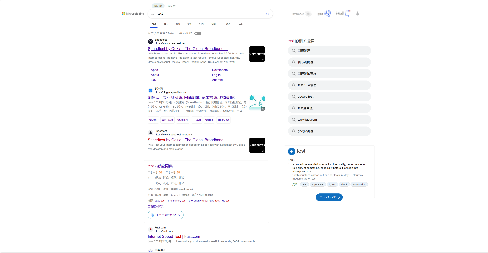

# Scripts说明

[**Edge浏览器**](https://www.microsoft.com/zh-cn/edge/download?form=MA13FJ)脚本管理工具推荐使用[**篡改猴 (Tampermonkey)**](https://microsoftedge.microsoft.com/addons/detail/%E7%AF%A1%E6%94%B9%E7%8C%B4/iikmkjmpaadaobahmlepeloendndfphd)

---

[**bing-search-center**](https://greasyfork.org/zh-CN/scripts/521997-bing%E6%90%9C%E7%B4%A2%E5%B1%85%E4%B8%AD%E6%98%BE%E7%A4%BA)——bing搜索结果居中显示脚本；

|  |  |
| ------------------------------------------------------------ | ------------------------------------------------------------ |
|  |  |

